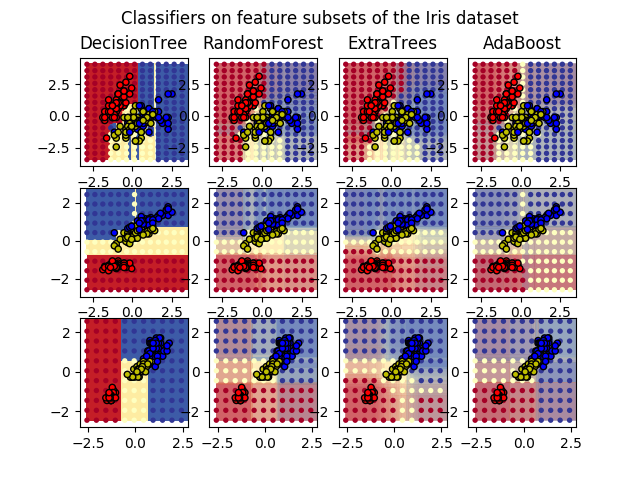
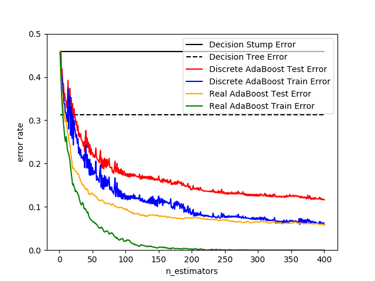
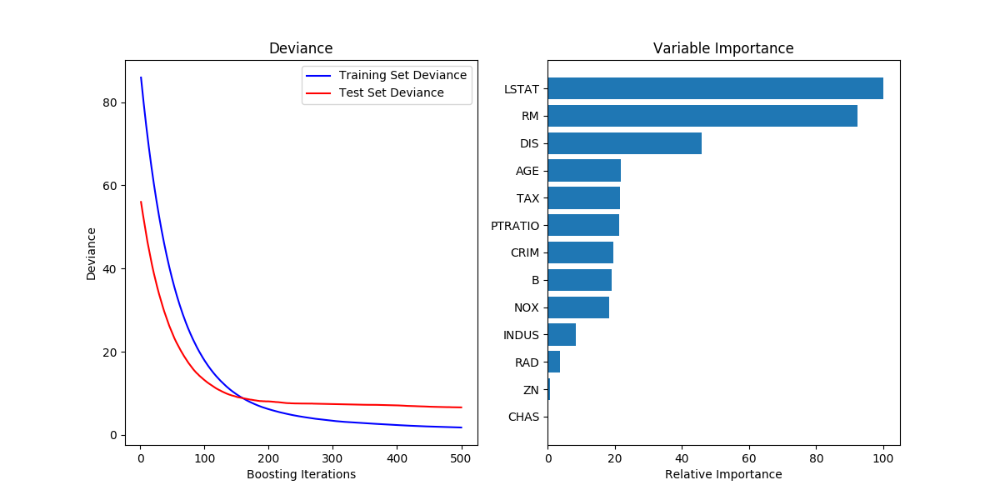
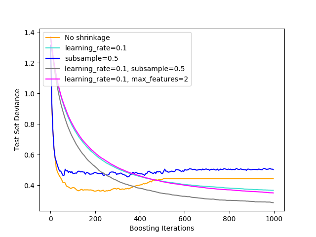
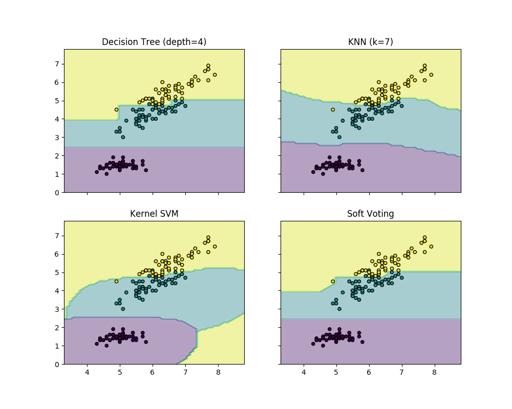
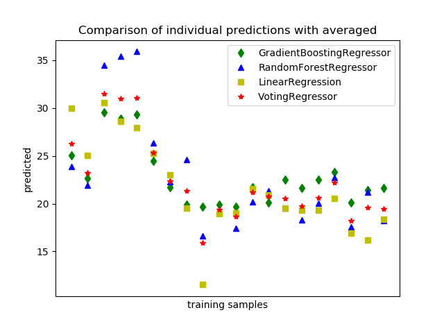

# 1.11. 集成方法

校验者:
        [@Dream on dreamer.](https://github.com/apachecn/scikit-learn-doc-zh)
        [@zehuichen123](https://github.com/zehuichen123)
        [@JanzenLiu](https://github.com/JanzenLiu)
        [@小瑶](https://github.com/apachecn/scikit-learn-doc-zh)
        [@\S^R^Y/](https://github.com/apachecn/scikit-learn-doc-zh)
        [@Loopy](https://github.com/loopyme)
        [@qinhanmin2014](https://github.com/qinhanmin2014)
翻译者:
        [@StupidStalker](https://github.com/apachecn/scikit-learn-doc-zh)
        [@文谊](https://github.com/apachecn/scikit-learn-doc-zh)
        [@t9UhoI](https://github.com/apachecn/scikit-learn-doc-zh)

>注意:在本文中 bagging 和 boosting 为了更好的保留原文意图，不进行翻译```estimator:估计器  base estimator:基估计器```

**集成方法** 的目标是把多个使用给定学习算法构建的基估计器的预测结果结合起来，从而获得比单个估计器更好的泛化能力/鲁棒性。

集成方法通常分为两种:

*   **平均方法**，该方法的原理是构建多个独立的估计器，然后取它们的预测结果的平均。一般来说组合之后的估计器是会比单个估计器要好的，因为它的方差减小了。

    **示例:** [Bagging 方法](#1111-bagging-meta-estimator（bagging-元估计器）) , [随机森林](#11121-随机森林) , …

*   相比之下，在 **boosting 方法** 中，基估计器是依次构建的，并且每一个基估计器都尝试去减少组合估计器的偏差。这种方法主要目的是为了结合多个弱模型，使集成的模型更加强大。

    **示例:** [AdaBoost](#1113-adaboost) , [梯度提升树](#1114-gradient-tree-boosting（梯度树提升）) , …

## 1.11.1. Bagging meta-estimator（Bagging 元估计器）

在集成算法中，bagging 方法会在原始训练集的随机子集上构建一类黑盒估计器的多个实例，然后把这些估计器的预测结果结合起来形成最终的预测结果。 该方法通过在构建模型的过程中引入随机性，来减少基估计器的方差(例如，决策树)。 在多数情况下，bagging 方法提供了一种非常简单的方式来对单一模型进行改进，而无需修改背后的算法。 因为 bagging 方法可以减小过拟合，所以通常在强分类器和复杂模型上使用时表现的很好（例如，完全生长的决策树，fully developed decision trees），相比之下 boosting 方法则在弱模型上表现更好（例如，浅层决策树，shallow decision trees）。

bagging 方法有很多种，其主要区别在于随机抽取训练子集的方法不同：

 *   如果抽取的数据集的随机子集是样例的随机子集，我们叫做粘贴 (Pasting) [B1999] 。
 *   如果样例抽取是有放回的，我们称为 Bagging [B1996] 。
 *   如果抽取的数据集的随机子集是特征的随机子集，我们叫做随机子空间 (Random Subspaces) [H1998] 。
 *   最后，如果基估计器构建在对于样本和特征抽取的子集之上时，我们叫做随机补丁 (Random Patches) [LG2012]。

在 scikit-learn 中，bagging 方法使用统一的 [`BaggingClassifier`](https://scikit-learn.org/stable/modules/generated/sklearn.ensemble.BaggingClassifier.html#sklearn.ensemble.BaggingClassifier "sklearn.ensemble.BaggingClassifier") 元估计器（或者 [`BaggingRegressor`](https://scikit-learn.org/stable/modules/generated/sklearn.ensemble.BaggingRegressor.html#sklearn.ensemble.BaggingRegressor "sklearn.ensemble.BaggingRegressor") ），基估计器和随机子集抽取策略由用户指定。`max_samples` 和 `max_features` 控制着子集的大小（对于样例和特征）， `bootstrap` 和 `bootstrap_features` 控制着样例和特征的抽取是有放回还是无放回的。 当使用样本子集时，通过设置 `oob_score=True` ，可以使用袋外(out-of-bag)样本来评估泛化精度。下面的代码片段说明了如何构造一个 `KNeighborsClassifier` 估计器的 bagging 集成实例，每一个基估计器都建立在 50% 的样本随机子集和 50% 的特征随机子集上。

```py
>>> from sklearn.ensemble import BaggingClassifier
>>> from sklearn.neighbors import KNeighborsClassifier
>>> bagging = BaggingClassifier(KNeighborsClassifier(),
...                             max_samples=0.5, max_features=0.5)

```

> **示例**:
>*   [Single estimator versus bagging: bias-variance decomposition](https://scikit-learn.org/stable/auto_examples/ensemble/plot_bias_variance.html#sphx-glr-auto-examples-ensemble-plot-bias-variance-py)

> **参考资料**
>* [B1999] L. Breiman, “Pasting small votes for classification in large databases and on-line”, Machine Learning, 36(1), 85-103, 1999.
>*  [B1996] L. Breiman, “Bagging predictors”, Machine Learning, 24(2), 123-140, 1996.
>*  [H1998] T. Ho, “The random subspace method for constructing decision forests”, Pattern Analysis and Machine Intelligence, 20(8), 832-844, 1998.
>*  [LG2012]  G. Louppe and P. Geurts, “Ensembles on Random Patches”, Machine Learning and Knowledge Discovery in Databases, 346-361, 2012.

## 1.11.2. 由随机树组成的森林

[`sklearn.ensemble`](classes.html#module-sklearn.ensemble "sklearn.ensemble") 模块包含两个基于 [随机决策树](tree.html#tree) 的平均算法： RandomForest 算法和 Extra-Trees 算法。 这两种算法都是专门为树而设计的扰动和组合技术（perturb-and-combine techniques） [[B1998]](#b1998) 。 这种技术通过在分类器构造过程中引入随机性来创建一组不同的分类器。集成分类器的预测结果就是单个分类器预测结果的平均值。

与其他分类器一样，森林分类器必须拟合（fit）两个数组： 保存训练样本的数组（或稀疏或稠密的）X，大小为 `[n_samples, n_features]`，和 保存训练样本目标值（类标签）的数组 Y，大小为 `[n_samples]`:

```py
>>> from sklearn.ensemble import RandomForestClassifier
>>> X = [[0, 0], [1, 1]]
>>> Y = [0, 1]
>>> clf = RandomForestClassifier(n_estimators=10)
>>> clf = clf.fit(X, Y)

```

同 [决策树](tree.html#tree) 一样，随机森林算法（forests of trees）也能用来解决 [多输出问题](tree.html#tree-multioutput) （如果 Y 的大小是 `[n_samples, n_outputs])` ）。

### 1.11.2.1. 随机森林

在随机森林中（参见 [`RandomForestClassifier`](https://scikit-learn.org/stable/modules/generated/sklearn.ensemble.RandomForestClassifier.html#sklearn.ensemble.RandomForestClassifier "sklearn.ensemble.RandomForestClassifier") 和 [`RandomForestRegressor`](https://scikit-learn.org/stable/modules/generated/sklearn.ensemble.RandomForestRegressor.html#sklearn.ensemble.RandomForestRegressor "sklearn.ensemble.RandomForestRegressor") 类）， 集成模型中的每棵树构建时的样本都是由训练集经过有放回抽样得来的（例如，自助采样法-bootstrap sample，这里采用西瓜书中的译法）。

另外，在构建树的过程中进行结点分割时，选择的分割点是所有特征的最佳分割点，或特征的大小为 `max_features` 的随机子集的最佳分割点。

这两种随机性的目的是降低估计器的方差。的确，单棵决策树通常具有高方差，容易过拟合。随机森林构建过程的随机性能够产生具有不同预测错误的决策树。通过取这些决策树的平均，能够消除部分错误。随机森林虽然能够通过组合不同的树降低方差，但是有时会略微增加偏差。在实际问题中，方差的降低通常更加显著，所以随机森林能够取得更好地效果。

与原始文献[B2001]不同的是，scikit-learn 的实现是取每个分类器预测概率的平均，而不是让每个分类器对类别进行投票。

### 1.11.2.2. 极限随机树

在极限随机树中（参见 [`ExtraTreesClassifier`](https://scikit-learn.org/stable/modules/generated/sklearn.ensemble.ExtraTreesClassifier.html#sklearn.ensemble.ExtraTreesClassifier "sklearn.ensemble.ExtraTreesClassifier") 和 [`ExtraTreesRegressor`](https://scikit-learn.org/stable/modules/generated/sklearn.ensemble.ExtraTreesRegressor.html#sklearn.ensemble.ExtraTreesRegressor "sklearn.ensemble.ExtraTreesRegressor") 类)， 计算分割点方法中的随机性进一步增强。 与随机森林相同，使用的特征是候选特征的随机子集；但是不同于随机森林寻找最具有区分度的阈值，这里的阈值是针对每个候选特征随机生成的，并且选择这些随机生成的阈值中的最佳者作为分割规则。 这种做法通常能够减少一点模型的方差，代价则是略微地增大偏差：

```py
>>> from sklearn.model_selection import cross_val_score
>>> from sklearn.datasets import make_blobs
>>> from sklearn.ensemble import RandomForestClassifier
>>> from sklearn.ensemble import ExtraTreesClassifier
>>> from sklearn.tree import DecisionTreeClassifier

>>> X, y = make_blobs(n_samples=10000, n_features=10, centers=100,
...     random_state=0)

>>> clf = DecisionTreeClassifier(max_depth=None, min_samples_split=2,
...     random_state=0)
>>> scores = cross_val_score(clf, X, y, cv=5)
>>> scores.mean()                               
0.98...

>>> clf = RandomForestClassifier(n_estimators=10, max_depth=None,
...     min_samples_split=2, random_state=0)
>>> scores = cross_val_score(clf, X, y, cv=5)
>>> scores.mean()                               
0.999...

>>> clf = ExtraTreesClassifier(n_estimators=10, max_depth=None,
...     min_samples_split=2, random_state=0)
>>> scores = cross_val_score(clf, X, y, cv=5)
>>> scores.mean() > 0.999
True
```

[](https://scikit-learn.org/stable/auto_examples/ensemble/plot_forest_iris.html)

### 1.11.2.3. 参数

使用这些方法时要调整的参数主要是 `n_estimators` 和 `max_features`。 前者（n_estimators）是森林里树的数量，通常数量越大，效果越好，但是计算时间也会随之增加。 此外要注意，当树的数量超过一个临界值之后，算法的效果并不会很显著地变好。 后者（max_features）是分割节点时考虑的特征的随机子集的大小。 这个值越低，方差减小得越多，但是偏差的增大也越多。 根据经验，回归问题中使用 `max_features = None` （总是考虑所有的特征）， 分类问题使用 `max_features = "sqrt"` （随机考虑 `sqrt(n_features)` 特征，其中 `n_features` 是特征的个数）是比较好的默认值。 `max_depth = None` 和 `min_samples_split = 2` 结合通常会有不错的效果（即生成完全的树）。 请记住，这些（默认）值通常不是最佳的，同时还可能消耗大量的内存，最佳参数值应由交叉验证获得。 另外，请注意，在随机森林中，默认使用自助采样法（`bootstrap = True`）， 然而 extra-trees 的默认策略是使用整个数据集（`bootstrap = False`）。 当使用自助采样法方法抽样时，泛化精度是可以通过剩余的或者袋外的样本来估算的，设置 `oob_score = True` 即可实现。

>注意:
>
>默认参数下模型复杂度是：`O(M*N*log(N))` ， 其中 `M` 是树的数目， `N` 是样本数。 可以通过设置以下参数来降低模型复杂度： `min_samples_split` , `max_leaf_nodes` , `max_depth` 和 `min_samples_leaf`。

### 1.11.2.4. 并行化

最后，这个模块还支持树的并行构建和预测结果的并行计算，这可以通过 `n_jobs` 参数实现。 如果设置 `n_jobs = k` ，则计算被划分为 `k` 个作业，并运行在机器的 `k` 个核上。 如果设置 `n_jobs = -1` ，则使用机器的所有核。 注意由于进程间通信具有一定的开销，这里的提速并不是线性的（即，使用 `k` 个作业不会快 `k` 倍）。 当然，在建立大量的树，或者构建单个树需要相当长的时间（例如，在大数据集上）时，（通过并行化）仍然可以实现显著的加速。

> **示例**:
>*   [Plot the decision surfaces of ensembles of trees on the iris dataset](https://scikit-learn.org/stable/auto_examples/ensemble/plot_forest_iris.html#sphx-glr-auto-examples-ensemble-plot-forest-iris-py)
>*   [Pixel importances with a parallel forest of trees](https://scikit-learn.org/stable/auto_examples/ensemble/plot_forest_importances_faces.html#sphx-glr-auto-examples-ensemble-plot-forest-importances-faces-py)
>*   [Face completion with a multi-output estimators](https://scikit-learn.org/stable/auto_examples/plot_multioutput_face_completion.html#sphx-glr-auto-examples-plot-multioutput-face-completion-py)

> **参考资料**
>* [B2001] Breiman, “Random Forests”, Machine Learning, 45(1), 5-32, 2001.
>* [B1998] Breiman, “Arcing Classifiers”, Annals of Statistics 1998.
>*   P. Geurts, D. Ernst., and L. Wehenkel, “Extremely randomized trees”, Machine Learning, 63(1), 3-42, 2006.

### 1.11.2.5. 特征重要性评估

特征对目标变量预测的相对重要性可以通过（树中的决策节点的）特征使用的相对顺序（即深度）来进行评估。 决策树顶部使用的特征对更大一部分输入样本的最终预测决策做出贡献；因此，可以使用接受每个特征对最终预测的贡献的样本比例来评估该 **特征的相对重要性** 。scikit-learn通过将特征贡献的样本比例与纯度减少相结合得到特征的重要性。

通过对多个随机树中的 **预期贡献率** （expected activity rates） **取平均**，可以减少这种估计的 **方差** ，并将其用于特征选择。这被称作平均纯度减少，或MDI。关于MDI以及随机森林特征重要性的更多信息，请参考[L2014]。

下面的示例展示了一个面部识别任务中每个像素的相对重要性，其中重要性由颜色（的深浅）来表示，使用的模型是 [`ExtraTreesClassifier`](https://scikit-learn.org/stable/modules/generated/sklearn.ensemble.ExtraTreesClassifier.html#sklearn.ensemble.ExtraTreesClassifier "sklearn.ensemble.ExtraTreesClassifier") 。

[](https://scikit-learn.org/stable/auto_examples/ensemble/plot_forest_importances_faces.html)

实际上，对于训练完成的模型这些估计值存储在 `feature_importances_` 属性中。 这是一个大小为 `(n_features,)` 的数组，其每个元素值为正，并且总和为 1.0。一个元素的值越高，其对应的特征对预测函数的贡献越大。

> **示例**:
>*   [Pixel importances with a parallel forest of trees](https://scikit-learn.org/stable/auto_examples/ensemble/plot_forest_importances_faces.html#sphx-glr-auto-examples-ensemble-plot-forest-importances-faces-py)
>*   [Feature importances with forests of trees](https://scikit-learn.org/stable/auto_examples/ensemble/plot_forest_importances.html#sphx-glr-auto-examples-ensemble-plot-forest-importances-py)

> **参考资料**：
>
>* [L2014]	G. Louppe, “Understanding Random Forests: From Theory to Practice”, PhD Thesis, U. of Liege, 2014.

### 1.11.2.6. 完全随机树嵌入

[`RandomTreesEmbedding`](https://scikit-learn.org/stable/modules/generated/sklearn.ensemble.RandomTreesEmbedding.html#sklearn.ensemble.RandomTreesEmbedding "sklearn.ensemble.RandomTreesEmbedding") 实现了一个无监督的数据转换。 通过由完全随机树构成的森林，[`RandomTreesEmbedding`](https://scikit-learn.org/stable/modules/generated/sklearn.ensemble.RandomTreesEmbedding.html#sklearn.ensemble.RandomTreesEmbedding "sklearn.ensemble.RandomTreesEmbedding") 使用数据最终归属的叶子节点的索引值（编号）对数据进行编码。 该索引以 one-of-K 方式编码，最终形成一个高维的稀疏二进制编码。 这种编码可以被非常高效地计算出来，并且可以作为其他学习任务的基础。 编码的大小和稀疏度可以通过选择树的数量和每棵树的最大深度来确定。对于集成中的每棵树的，每个样本对应其中的一个叶节点。 编码的大小（维度）最多为 `n_estimators * 2 ** max_depth` ，即森林中的叶子节点的最大数。

由于相邻数据点更可能位于树的同一叶子中，该变换可以作为一种隐式地非参数密度估计。

> **示例**:
>
>*   [Hashing feature transformation using Totally Random Trees](https://scikit-learn.org/stable/auto_examples/ensemble/plot_random_forest_embedding.html#sphx-glr-auto-examples-ensemble-plot-random-forest-embedding-py)
>*   [Manifold learning on handwritten digits: Locally Linear Embedding, Isomap…](https://scikit-learn.org/stable/auto_examples/manifold/plot_lle_digits.html#sphx-glr-auto-examples-manifold-plot-lle-digits-py) 比较了手写体数字的非线性降维技术。
>*   [Feature transformations with ensembles of trees](https://scikit-learn.org/stable/auto_examples/ensemble/plot_feature_transformation.html#sphx-glr-auto-examples-ensemble-plot-feature-transformation-py) 比较了基于树的有监督和无监督特征变换.

>**See also** [流形学习](manifold.html#manifold) 方法也可以用于特征空间的非线性表示, 以及降维.

## 1.11.3. AdaBoost

模型 [`sklearn.ensemble`](classes.html#module-sklearn.ensemble "sklearn.ensemble") 包含了流行的提升算法 AdaBoost, 这个算法是由 Freund and Schapire 在 1995 年提出来的 [FS1995].

AdaBoost 的核心思想是用反复修改的数据（校对者注：主要是修正数据的权重）来训练一系列的弱学习器(一个弱学习器模型仅仅比随机猜测好一点, 比如一个简单的决策树),由这些弱学习器的预测结果通过加权投票(或加权求和)的方式组合, 得到我们最终的预测结果。在每一次所谓的提升（boosting）迭代中，数据的修改由应用于每一个训练样本的（新） 的权重 , , …,  组成（校对者注：即修改每一个训练样本应用于新一轮学习器的权重）。 初始化时,将所有弱学习器的权重都设置为  ,因此第一次迭代仅仅是通过原始数据训练出一个弱学习器。在接下来的 连续迭代中,样本的权重逐个地被修改,学习算法也因此要重新应用这些已经修改的权重。在给定的一个迭代中, 那些在上一轮迭代中被预测为错误结果的样本的权重将会被增加，而那些被预测为正确结果的样本的权 重将会被降低。随着迭代次数的增加，那些难以预测的样例的影响将会越来越大，每一个随后的弱学习器都将 会被强迫更加关注那些在之前被错误预测的样例 [HTF].

[](https://scikit-learn.org/stable/auto_examples/ensemble/plot_adaboost_hastie_10_2.html)

AdaBoost 既可以用在分类问题也可以用在回归问题中:

*   对于 multi-class 分类， [`AdaBoostClassifier`](https://scikit-learn.org/stable/modules/generated/sklearn.ensemble.AdaBoostClassifier.html#sklearn.ensemble.AdaBoostClassifier "sklearn.ensemble.AdaBoostClassifier") 实现了 AdaBoost-SAMME 和 AdaBoost-SAMME.R [ZZRH2009].
*   对于回归， [`AdaBoostRegressor`](https://scikit-learn.org/stable/modules/generated/sklearn.ensemble.AdaBoostRegressor.html#sklearn.ensemble.AdaBoostRegressor "sklearn.ensemble.AdaBoostRegressor") 实现了 AdaBoost.R2 [[D1997]](#d1997).

### 1.11.3.1. 使用方法

下面的示例展示了如何训练一个包含 100 个弱学习器的 AdaBoost 分类器:

```py
>>> from sklearn.model_selection import cross_val_score
>>> from sklearn.datasets import load_iris
>>> from sklearn.ensemble import AdaBoostClassifier

>>> iris = load_iris()
>>> clf = AdaBoostClassifier(n_estimators=100)
>>> scores = cross_val_score(clf, iris.data, iris.target)
>>> scores.mean()                             
0.9...

```

弱学习器的数量由参数 `n_estimators` 来控制。 `learning_rate` 参数用来控制每个弱学习器对 最终的结果的贡献程度（校对者注：其实应该就是控制每个弱学习器的权重修改速率）。 弱学习器默认使用决策树。不同的弱学习器可以通过参数 `base_estimator` 来指定。 获取一个好的预测结果主要需要调整的参数是 `n_estimators` 和 `base_estimator` 的复杂度 (例如:对于弱学习器为决策树的情况，树的深度 `max_depth` 或叶子节点的最小样本数 `min_samples_leaf` 等都是控制树的复杂度的参数)

> **示例**:
>
>*   [Discrete versus Real AdaBoost](https://scikit-learn.org/stable/auto_examples/ensemble/plot_adaboost_hastie_10_2.html#sphx-glr-auto-examples-ensemble-plot-adaboost-hastie-10-2-py) 使用 AdaBoost-SAMME 和 AdaBoost-SAMME.R 比较 decision stump， decision tree（决策树）和 boosted decision stump（增强决策树）的分类错误。
>*   [Multi-class AdaBoosted Decision Trees](https://scikit-learn.org/stable/auto_examples/ensemble/plot_adaboost_multiclass.html#sphx-glr-auto-examples-ensemble-plot-adaboost-multiclass-py) 展示了 AdaBoost-SAMME 和 AdaBoost-SAMME.R 在 multi-class （多类）问题上的性能。
>*   [Two-class AdaBoost](https://scikit-learn.org/stable/auto_examples/ensemble/plot_adaboost_twoclass.html#sphx-glr-auto-examples-ensemble-plot-adaboost-twoclass-py) 展示了使用 AdaBoost-SAMME 的非线性可分两类问题的决策边界和决策函数值。
>*   [Decision Tree Regression with AdaBoost](https://scikit-learn.org/stable/auto_examples/ensemble/plot_adaboost_regression.html#sphx-glr-auto-examples-ensemble-plot-adaboost-regression-py) 使用 AdaBoost.R2 算法证明了回归。

> **参考资料**:
>* [FS1995] Y. Freund, and R. Schapire, “A Decision-Theoretic Generalization of On-Line Learning and an Application to Boosting”, 1997.
>* [ZZRH2009] J. Zhu, H. Zou, S. Rosset, T. Hastie. “Multi-class AdaBoost”, 2009.
>* [D1997] Drucker. “Improving Regressors using Boosting Techniques”, 1997.
>* [HTF] T. Hastie, R. Tibshirani and J. Friedman, “Elements of Statistical Learning Ed. 2”, Springer, 2009.

## 1.11.4. Gradient Tree Boosting（梯度树提升）

[Gradient Tree Boosting](https://en.wikipedia.org/wiki/Gradient_boosting) 或梯度提升回归树（GBRT）是对于任意的可微损失函数的提升算法的泛化。 GBRT 是一个准确高效的现有程序， 它既能用于分类问题也可以用于回归问题。梯度树提升模型被应用到各种领域，包括网页搜索排名和生态领域。

GBRT 的优点:

*   对混合型数据的自然处理（异构特征）
*   强大的预测能力
*   在输出空间中对异常点的鲁棒性(通过具有鲁棒性的损失函数实现)

GBRT 的缺点:

*   可扩展性差（校对者注：此处的可扩展性特指在更大规模的数据集/复杂度更高的模型上使用的能力，而非我们通常说的功能的扩展性；GBRT 支持自定义的损失函数，从这个角度看它的扩展性还是很强的！）。由于提升算法的有序性(也就是说下一步的结果依赖于上一步)，因此很难做并行.

模块 [`sklearn.ensemble`](classes.html#module-sklearn.ensemble "sklearn.ensemble") 通过梯度提升树提供了分类和回归的方法.

> **注意**：在[LightGBM](https://github.com/Microsoft/LightGBM)的启发下，Scikit-learn 0.21引入了两种新的梯度提升树的实验实现，即 [HistGradientBoostingClassifier](https://scikit-learn.org/stable/modules/generated/sklearn.ensemble.HistGradientBoostingClassifier.html#sklearn.ensemble.HistGradientBoostingClassifier)和 [HistGradientBoostingRegressor](https://scikit-learn.org/stable/modules/generated/sklearn.ensemble.HistGradientBoostingRegressor.html#sklearn.ensemble.HistGradientBoostingRegressor)。这些快速估计器首先将输入样本X放入整数值的箱子(通常是256个箱子)中，这极大地减少了需要考虑的分裂点的数量，并允许算法利用基于整数的数据结构(直方图)，而不是依赖于排序后的连续值。
>
>当样本数量大于数万个样本时，基于直方图的新估计值可以比连续估计值快几个数量级。这些新的估计器的API略有不同，目前还不支持[GradientBoostingClassifier](https://scikit-learn.org/stable/modules/generated/sklearn.ensemble.GradientBoostingClassifier.html#sklearn.ensemble.GradientBoostingClassifier)和[GradientBoostingRegressor](https://scikit-learn.org/stable/modules/generated/sklearn.ensemble.GradientBoostingRegressor.html#sklearn.ensemble.GradientBoostingRegressor)的一些特性。
>
>这些新的评估器目前仍处于试验阶段:它们的预测和API可能会在没有任何弃用周期的情况下发生变化。要使用它们，您需要显式地导入`enable_hist_gradient_boost`:
> ```py
  >>> # explicitly require this experimental feature
  >>> from sklearn.experimental import enable_hist_gradient_boosting  # noqa
  >>> # now you can import normally from ensemble
  >>> from sklearn.ensemble import HistGradientBoostingClassifier
  ```
>下面的指南只关注[GradientBoostingClassifier](https://scikit-learn.org/stable/modules/generated/sklearn.ensemble.GradientBoostingClassifier.html#sklearn.ensemble.GradientBoostingClassifier)和[GradientBoostingRegressor](https://scikit-learn.org/stable/modules/generated/sklearn.ensemble.GradientBoostingRegressor.html#sklearn.ensemble.GradientBoostingRegressor)，这可能是小样本量的首选，因为在这个设置中，装箱可能会导致分割点过于接近。

### 1.11.4.1. 分类

[`GradientBoostingClassifier`](https://scikit-learn.org/stable/modules/generated/sklearn.ensemble.GradientBoostingClassifier.html#sklearn.ensemble.GradientBoostingClassifier "sklearn.ensemble.GradientBoostingClassifier") 既支持二分类又支持多分类问题。 下面的示例展示了如何训练一个包含 100 个决策树弱学习器的梯度提升分类器:

```py
>>> from sklearn.datasets import make_hastie_10_2
>>> from sklearn.ensemble import GradientBoostingClassifier

>>> X, y = make_hastie_10_2(random_state=0)
>>> X_train, X_test = X[:2000], X[2000:]
>>> y_train, y_test = y[:2000], y[2000:]

>>> clf = GradientBoostingClassifier(n_estimators=100, learning_rate=1.0,
...     max_depth=1, random_state=0).fit(X_train, y_train)
>>> clf.score(X_test, y_test)                 
0.913...

```

弱学习器(例如:回归树)的数量由参数 `n_estimators` 来控制；每个树的大小可以通过由参数 `max_depth` 设置树的深度，或者由参数 `max_leaf_nodes` 设置叶子节点数目来控制。 `learning_rate` 是一个在 (0,1] 之间的超参数，这个参数通过 shrinkage(缩减步长) 来控制过拟合。

>**注意**:超过两类的分类问题需要在每一次迭代时推导 `n_classes` 个回归树。因此，所有的需要推导的树数量等于 `n_classes * n_estimators` 。对于拥有大量类别的数据集我们强烈推荐使用 [`RandomForestClassifier`](https://scikit-learn.org/stable/modules/generated/sklearn.ensemble.RandomForestClassifier.html#sklearn.ensemble.RandomForestClassifier "sklearn.ensemble.RandomForestClassifier") 来代替 [`GradientBoostingClassifier`](https://scikit-learn.org/stable/modules/generated/sklearn.ensemble.GradientBoostingClassifier.html#sklearn.ensemble.GradientBoostingClassifier "sklearn.ensemble.GradientBoostingClassifier") 。

### 1.11.4.2. 回归

对于回归问题 [`GradientBoostingRegressor`](https://scikit-learn.org/stable/modules/generated/sklearn.ensemble.GradientBoostingRegressor.html#sklearn.ensemble.GradientBoostingRegressor "sklearn.ensemble.GradientBoostingRegressor") 支持一系列 [different loss functions](#gradient-boosting-loss) ，这些损失函数可以通过参数 `loss` 来指定；对于回归问题默认的损失函数是最小二乘损失函数（ `'ls'` ）。

```py
>>> import numpy as np
>>> from sklearn.metrics import mean_squared_error
>>> from sklearn.datasets import make_friedman1
>>> from sklearn.ensemble import GradientBoostingRegressor

>>> X, y = make_friedman1(n_samples=1200, random_state=0, noise=1.0)
>>> X_train, X_test = X[:200], X[200:]
>>> y_train, y_test = y[:200], y[200:]
>>> est = GradientBoostingRegressor(n_estimators=100, learning_rate=0.1,
...     max_depth=1, random_state=0, loss='ls').fit(X_train, y_train)
>>> mean_squared_error(y_test, est.predict(X_test))    
5.00...

```

下图展示了应用损失函数为最小二乘损失，基学习器个数为 500 的 [`GradientBoostingRegressor`](https://scikit-learn.org/stable/modules/generated/sklearn.ensemble.GradientBoostingRegressor.html#sklearn.ensemble.GradientBoostingRegressor "sklearn.ensemble.GradientBoostingRegressor") 来处理 [`sklearn.datasets.load_boston`](https://scikit-learn.org/stable/modules/generated/sklearn.datasets.load_boston.html#sklearn.datasets.load_boston "sklearn.datasets.load_boston") 数据集的结果。左图表示每一次迭代的训练误差和测试误差。每一次迭代的训练误差保存在提升树模型的 `train_score_` 属性中，每一次迭代的测试误差能够通过 [`staged_predict`](https://scikit-learn.org/stable/modules/generated/sklearn.ensemble.GradientBoostingRegressor.html#sklearn.ensemble.GradientBoostingRegressor.staged_predict "sklearn.ensemble.GradientBoostingRegressor.staged_predict") 方法获取，该方法返回一个生成器，用来产生每一 个迭代的预测结果。类似下面这样的图表，可以用于决定最优的树的数量，从而进行提前停止。右图表示每个特征的重要性，它 可以通过 `feature_importances_` 属性来获取.

[](https://scikit-learn.org/stable/auto_examples/ensemble/plot_gradient_boosting_regression.html)

> **示例**:
>*   [Gradient Boosting regression](https://scikit-learn.org/stable/auto_examples/ensemble/plot_gradient_boosting_regression.html#sphx-glr-auto-examples-ensemble-plot-gradient-boosting-regression-py)
>*   [Gradient Boosting Out-of-Bag estimates](https://scikit-learn.org/stable/auto_examples/ensemble/plot_gradient_boosting_oob.html#sphx-glr-auto-examples-ensemble-plot-gradient-boosting-oob-py)

### 1.11.4.3. 训练额外的弱学习器

 [`GradientBoostingRegressor`](https://scikit-learn.org/stable/modules/generated/sklearn.ensemble.GradientBoostingRegressor.html#sklearn.ensemble.GradientBoostingRegressor "sklearn.ensemble.GradientBoostingRegressor") 和 [`GradientBoostingClassifier`](https://scikit-learn.org/stable/modules/generated/sklearn.ensemble.GradientBoostingClassifier.html#sklearn.ensemble.GradientBoostingClassifier "sklearn.ensemble.GradientBoostingClassifier") 都支持设置参数 `warm_start=True` ，这样设置允许我们在已经训练的模型上面添加更多的估计器。

```py
>>> _ = est.set_params(n_estimators=200, warm_start=True)  # set warm_start and new nr of trees
>>> _ = est.fit(X_train, y_train) # fit additional 100 trees to est
>>> mean_squared_error(y_test, est.predict(X_test))    
3.84...

```

### 1.11.4.4. 控制树的大小

回归树基学习器的大小定义了可以被梯度提升模型捕捉到的变量（即特征）相互作用（即多个特征共同对预测产生影响）的程度。 通常一棵深度为 `h` 的树能捕获到秩为 `h` 的相互作用。这里有两种控制单棵回归树大小的方法。

如果你指定 `max_depth=h` ，那么将会产生一个深度为 `h` 的完全二叉树。这棵树将会有（至多） `2**h` 个叶子节点和 `2**h - 1` 个切分节点。

另外，你能通过参数 `max_leaf_nodes` 指定叶子节点的数量来控制树的大小。在这种情况下，树将会使用最优优先搜索来生成，这种搜索方式是通过每次选取对不纯度提升最大的节点来展开。一棵 `max_leaf_nodes=k` 的树拥有 `k - 1` 个切分节点，因此可以模拟秩最高达到 `max_leaf_nodes - 1` 的相互作用（即 `max_leaf_nodes - 1` 个特征共同决定预测值）。

我们发现 `max_leaf_nodes=k` 可以给出与 `max_depth=k-1` 品质相当的结果，但是其训练速度明显更快，同时也会以多一点的训练误差作为代价。参数 `max_leaf_nodes` 对应于文章 [[F2001]](#f2001) 中梯度提升章节中的变量 `J` ，同时与 R 语言的 gbm 包的参数 `interaction.depth` 相关，两者间的关系是 `max_leaf_nodes == interaction.depth + 1` 。

### 1.11.4.5. Mathematical formulation（数学公式）

GBRT 可以认为是以下形式的可加模型:

 

其中  是基本函数,在提升算法场景中它通常被称作 _weak learners_ 。梯度树提升算法（Gradient Tree Boosting）使用固定大小 的 [decision trees](tree.html#tree) 作为弱分类器,决策树本身拥有的一些特性使它能够在提升过程中变得有价值, 即处理混合类型数据以及构建具有复杂功能模型的能力.

与其他提升算法类似， GBRT 利用前向分步算法思想构建加法模型:


在每一个阶段中，基于当前模型  和拟合函数  选择合适的决策树函数  ,从而最小化损失函数  。


初始模型  根据不同的问题指定,对于最小二乘回归,通常选择目标值的平均值.

>**注意**:初始化模型也能够通过 `init` 参数来指定，但传递的对象需要实现 `fit` 和 `predict` 函数。

梯度提升（Gradient Boosting）尝试通过最速下降法以数字方式解决这个最小化问题.最速下降方向是在当前模型  下的损失函数的负梯度方向，其中模型  可以计算任何可微损失函数:


其中步长  通过如下方式线性搜索获得:


该算法处理分类和回归问题不同之处在于具体损失函数的使用。

#### 1.11.4.5.1. Loss Functions（损失函数）

以下是目前支持的损失函数,具体损失函数可以通过参数 `loss` 指定:

*   回归 (Regression)
     *   Least squares ( `'ls'` ): 由于其优越的计算性能,该损失函数成为回归算法中的自然选择。 初始模型 （校对者注：即损失函数的初始值，下同） 通过目标值的均值给出。
     *   Least absolute deviation ( `'lad'` ): 回归中具有鲁棒性的损失函数,初始模型通过目 标值的中值给出。
     *   Huber ( `'huber'` ): 回归中另一个具有鲁棒性的损失函数,它是最小二乘和最小绝对偏差两者的结合. 其利用 `alpha` 来控制模型对于异常点的敏感度(详细介绍请参考 [[F2001]](#f2001)).
     *   Quantile ( `'quantile'` ): 分位数回归损失函数.用 `0 &lt; alpha &lt; 1` 来指定分位数这个损 失函数可以用来产生预测间隔。（详见 [Prediction Intervals for Gradient Boosting Regression](https://scikit-learn.org/stable/auto_examples/ensemble/plot_gradient_boosting_quantile.html#sphx-glr-auto-examples-ensemble-plot-gradient-boosting-quantile-py) ）。
*   分类 (Classification)
     *   Binomial deviance (`'deviance'`): 对于二分类问题(提供概率估计)即负的二项 log 似然损失函数。模型以 log 的比值比来初始化。
     *   Multinomial deviance (`'deviance'`): 对于多分类问题的负的多项log似然损失函数具有 `n_classes` 个互斥的类。提供概率估计。 初始模型由每个类的先验概率给出.在每一次迭代中 `n_classes` 回归树被构建,这使得 GBRT 在处理多类别数据集时相当低效。
     *   Exponential loss (`'exponential'`): 与 [`AdaBoostClassifier`](https://scikit-learn.org/stable/modules/generated/sklearn.ensemble.AdaBoostClassifier.html#sklearn.ensemble.AdaBoostClassifier "sklearn.ensemble.AdaBoostClassifier") 具有相同的损失函数。与 `'deviance'` 相比，对被错误标记的样本的鲁棒性较差，仅用于在二分类问题。

### 1.11.4.6. Regularization（正则化）

#### 1.11.4.6.1. 收缩率 （Shrinkage）

[F2001]提出一个简单的正则化策略,通过一个因子  来衡量每个弱分类器对于最终结果的贡献:


参数  由于它可以控制梯度下降的步长, 因此也叫作 **learning rate** ，它可以通过 `learning_rate` 参数来设置.

在训练一定数量的弱分类器时,参数 `learning_rate` 和参数 `n_estimators` 之间有很强的制约关系。 较小的 `learning_rate` 需要大量的弱分类器才能维持训练误差的稳定。经验表明数值较小的 `learning_rate` 将会得到更好的测试误差。 [HTF2009]推荐把 `learning_rate` 设置为一个较小的常数 (例如: `learning_rate &lt;= 0.1` )同时通过提前停止策略来选择合适的 `n_estimators` . 有关 `learning_rate` 和 `n_estimators` 更详细的讨论可以参考 [R2007]

#### 1.11.4.6.2. 子采样 （Subsampling）

[F1999]提出了随机梯度提升,这种方法将梯度提升（gradient boosting）和 bootstrap averaging(bagging) 相结合。在每次迭代中,基分类器是通过抽取所有可利用训练集中一小部分的 `subsample` 训练得到的子样本采用无放回的方式采样。 `subsample` 参数的值一般设置为 0.5 。

下图表明了收缩与否和子采样对于模型拟合好坏的影响。我们可以明显看到指定收缩率比没有收缩拥有更好的表现。而将子采样和收缩率相结合能进一步的提高模型的准确率。相反，使用子采样而不使用收缩的结果十分糟糕。

[](https://scikit-learn.org/stable/auto_examples/ensemble/plot_gradient_boosting_regularization.html)

另一个减少方差的策略是特征子采样,这种方法类似于 [`RandomForestClassifier`](https://scikit-learn.org/stable/modules/generated/sklearn.ensemble.RandomForestClassifier.html#sklearn.ensemble.RandomForestClassifier "sklearn.ensemble.RandomForestClassifier") 中的随机分割。子采样的特征数可以通过参数 `max_features` 来控制。

>**注意**:采用一个较小的 `max_features` 值能大大缩减模型的训练时间。

随机梯度提升允许计算测试偏差的袋外估计值（Out-of-bag），方法是计算那些不在自助采样之内的样本偏差的改进。这个改进保存在属性 `oob_improvement_` 中 `oob_improvement_[i]` 如果将第 i 步添加到当前预测中，则可以改善 OOB 样本的损失。袋外估计可以使用在模型选择中，例如决定最优迭代次数。 OOB 估计通常都很悲观,因此我们推荐使用交叉验证来代替它，而当交叉验证太耗时时我们就只能使用 OOB 了。

> **示例**:
>*   [Gradient Boosting regularization](https://scikit-learn.org/stable/auto_examples/ensemble/plot_gradient_boosting_regularization.html#sphx-glr-auto-examples-ensemble-plot-gradient-boosting-regularization-py)
>*   [Gradient Boosting Out-of-Bag estimates](https://scikit-learn.org/stable/auto_examples/ensemble/plot_gradient_boosting_oob.html#sphx-glr-auto-examples-ensemble-plot-gradient-boosting-oob-py)
*   [OOB Errors for Random Forests](https://scikit-learn.org/stable/auto_examples/ensemble/plot_ensemble_oob.html#sphx-glr-auto-examples-ensemble-plot-ensemble-oob-py)

### 1.11.4.7. Interpretation（解释性）

通过简单地可视化树结构可以很容易地解释单个决策树,然而对于梯度提升模型来说,一般拥有数百棵/种回归树，将每一棵树都可视化来解释整个模型是很困难的。幸运的是，有很多关于总结和解释梯度提升模型的技术。

#### 1.11.4.7.1. Feature importance（特征重要性）

通常情况下每个特征对于预测目标的影响是不同的.在很多情形下大多数特征和预测结果是无关的。当解释一个模型时，第一个问题通常是：这些重要的特征是什么？他们如何在预测目标方面产生积极的影响的？

单个决策树本质上是通过选择最佳切分点来进行特征选择.这个信息可以用来评定每个特征的重要性。基本思想是：在树的分割点中使用的特征越频繁，特征越重要。 这个特征重要性的概念可以通过简单地平均每棵树的特征重要性来扩展到决策树集合。（详见 [特征重要性评估](#random-forest-feature-importance) ）。

对于一个训练好的梯度提升模型，其特征重要性分数可以通过属性 `feature_importances_` 查看:

```py
>>> from sklearn.datasets import make_hastie_10_2
>>> from sklearn.ensemble import GradientBoostingClassifier

>>> X, y = make_hastie_10_2(random_state=0)
>>> clf = GradientBoostingClassifier(n_estimators=100, learning_rate=1.0,
...     max_depth=1, random_state=0).fit(X, y)
>>> clf.feature_importances_  
array([0.10..., 0.10..., 0.11..., ...
```

> **示例**:
>*   [Gradient Boosting regression](https://scikit-learn.org/stable/auto_examples/ensemble/plot_gradient_boosting_regression.html#sphx-glr-auto-examples-ensemble-plot-gradient-boosting-regression-py)

## 1.11.5. Voting Classifier（投票分类器）

`VotingClassifier` （投票分类器）的原理是结合了多个不同的机器学习分类器,并且采用多数表决（majority vote）（硬投票） 或者平均预测概率（软投票）的方式来预测分类标签。 这样的分类器可以用于一组同样表现良好的模型,以便平衡它们各自的弱点。

### 1.11.5.1. 多数类标签 （又称为 多数/硬投票）

在多数投票中，对于每个特定样本的预测类别标签是所有单独分类器预测的类别标签中票数占据多数（模式）的类别标签。

例如，如果给定样本的预测是

*   classifier 1 -&gt; class 1
*   classifier 2 -&gt; class 1
*   classifier 3 -&gt; class 2

类别 1 占据多数,通过 `voting='hard'` 参数设置投票分类器为多数表决方式，会得到该样本的预测结果是类别 1 。

在平局的情况下,投票分类器（VotingClassifier）将根据升序排序顺序选择类标签。 例如，场景如下:

*   classifier 1 -&gt; class 2
*   classifier 2 -&gt; class 1

这种情况下， class 1 将会被指定为该样本的类标签。

#### 1.11.5.1.1. 用法

以下示例显示如何训练多数规则分类器：

```py
>>> from sklearn import datasets
>>> from sklearn.model_selection import cross_val_score
>>> from sklearn.linear_model import LogisticRegression
>>> from sklearn.naive_bayes import GaussianNB
>>> from sklearn.ensemble import RandomForestClassifier
>>> from sklearn.ensemble import VotingClassifier

>>> iris = datasets.load_iris()
>>> X, y = iris.data[:, 1:3], iris.target

>>> clf1 = LogisticRegression(solver='lbfgs', multi_class='multinomial',
...                           random_state=1)
>>> clf2 = RandomForestClassifier(n_estimators=50, random_state=1)
>>> clf3 = GaussianNB()

>>> eclf = VotingClassifier(estimators=[('lr', clf1), ('rf', clf2), ('gnb', clf3)], voting='hard')

>>> for clf, label in zip([clf1, clf2, clf3, eclf], ['Logistic Regression', 'Random Forest', 'naive Bayes', 'Ensemble']):
...     scores = cross_val_score(clf, X, y, cv=5, scoring='accuracy')
...     print("Accuracy: %0.2f (+/- %0.2f) [%s]" % (scores.mean(), scores.std(), label))
Accuracy: 0.95 (+/- 0.04) [Logistic Regression]
Accuracy: 0.94 (+/- 0.04) [Random Forest]
Accuracy: 0.91 (+/- 0.04) [naive Bayes]
Accuracy: 0.95 (+/- 0.04) [Ensemble]
```

### 1.11.5.2. 加权平均概率 （软投票）

与多数投票（硬投票）相比，软投票将类别标签返回为预测概率之和的 argmax 。

具体的权重可以通过权重参数 `weights` 分配给每个分类器。当提供权重参数 `weights` 时，收集每个分类器的预测分类概率， 乘以分类器权重并取平均值。然后将具有最高平均概率的类别标签确定为最终类别标签。

为了用一个简单的示例来说明这一点，假设我们有 3 个分类器和一个 3 类分类问题，我们给所有分类器赋予相等的权重：w1 = 1,w2 = 1,w3 = 1 。

样本的加权平均概率计算如下：

| 分类器 | 类别 1 | 类别 2 | 类别 3 |
| --- | --- | --- | --- |
| 分类器 1 | w1 * 0.2 | w1 * 0.5 | w1 * 0.3 |
| 分类器 2 | w2 * 0.6 | w2 * 0.3 | w2 * 0.1 |
| 分类器 3 | w3 * 0.3 | w3 * 0.4 | w3 * 0.3 |
| 加权平均的结果 | 0.37 | 0.4 | 0.23 |

这里可以看出，预测的类标签是 2，因为它具有最大的平均概率.

下边的示例程序说明了当软投票分类器（soft VotingClassifier）是基于线性支持向量机（linear SVM）、决策树（Decision Tree）、K 近邻（K-nearest）分类器时，决策域可能的变化情况:

```py
>>> from sklearn import datasets
>>> from sklearn.tree import DecisionTreeClassifier
>>> from sklearn.neighbors import KNeighborsClassifier
>>> from sklearn.svm import SVC
>>> from itertools import product
>>> from sklearn.ensemble import VotingClassifier

>>> # Loading some example data
>>> iris = datasets.load_iris()
>>> X = iris.data[:, [0, 2]]
>>> y = iris.target

>>> # Training classifiers
>>> clf1 = DecisionTreeClassifier(max_depth=4)
>>> clf2 = KNeighborsClassifier(n_neighbors=7)
>>> clf3 = SVC(gamma='scale', kernel='rbf', probability=True)
>>> eclf = VotingClassifier(estimators=[('dt', clf1), ('knn', clf2), ('svc', clf3)],
...                         voting='soft', weights=[2, 1, 2])

>>> clf1 = clf1.fit(X, y)
>>> clf2 = clf2.fit(X, y)
>>> clf3 = clf3.fit(X, y)
>>> eclf = eclf.fit(X, y)
```

[](https://scikit-learn.org/stable/auto_examples/ensemble/plot_voting_decision_regions.html)

### 1.11.5.3. 投票分类器（VotingClassifier）在网格搜索（GridSearchCV）应用

为了调整每个估计器的超参数，[VotingClassifier](https://scikit-learn.org/stable/modules/generated/sklearn.ensemble.VotingClassifier.html#sklearn.ensemble.VotingClassifier) 也可以和 [GridSearchCV](https://scikit-learn.org/stable/modules/generated/sklearn.model_selection.GridSearchCV.html#sklearn.model_selection.GridSearchCV) 一起使用:

```py
>>> from sklearn.model_selection import GridSearchCV
>>> clf1 = LogisticRegression(random_state=1)
>>> clf2 = RandomForestClassifier(random_state=1)
>>> clf3 = GaussianNB()
>>> eclf = VotingClassifier(estimators=[('lr', clf1), ('rf', clf2), ('gnb', clf3)], voting='soft')

>>> params = {'lr__C': [1.0, 100.0], 'rf__n_estimators': [20, 200],}

>>> grid = GridSearchCV(estimator=eclf, param_grid=params, cv=5)
>>> grid = grid.fit(iris.data, iris.target)

```

#### 1.11.5.3.1. 用法

为了通过预测的类别概率来预测类别标签(投票分类器中的 scikit-learn estimators 必须支持 `predict_proba` 方法):

```py
>>> eclf = VotingClassifier(estimators=[('lr', clf1), ('rf', clf2), ('gnb', clf3)], voting='soft')

```

可选地，也可以为单个分类器提供权重:

```py
>>> eclf = VotingClassifier(estimators=[('lr', clf1), ('rf', clf2), ('gnb', clf3)], voting='soft', weights=[2,5,1])
```

## 1.11.6. 投票回归器(Voting Regressor)
[投票回归器](https://scikit-learn.org/stable/modules/generated/sklearn.ensemble.VotingRegressor.html#sklearn.ensemble.VotingRegressor)背后的思想是将概念上不同的机器学习回归器组合起来，并返回平均预测值。这样一个回归器对于一组同样表现良好的模型是有用的，以便平衡它们各自的弱点。

下面的示例展示了如何匹配投票回归器:
``` py
>>> from sklearn import datasets
>>> from sklearn.ensemble import GradientBoostingRegressor
>>> from sklearn.ensemble import RandomForestRegressor
>>> from sklearn.linear_model import LinearRegression
>>> from sklearn.ensemble import VotingRegressor

>>> # Loading some example data
>>> boston = datasets.load_boston()
>>> X = boston.data
>>> y = boston.target

>>> # Training classifiers
>>> reg1 = GradientBoostingRegressor(random_state=1, n_estimators=10)
>>> reg2 = RandomForestRegressor(random_state=1, n_estimators=10)
>>> reg3 = LinearRegression()
>>> ereg = VotingRegressor(estimators=[('gb', reg1), ('rf', reg2), ('lr', reg3)])
>>> ereg = ereg.fit(X, y)
```



> **示例**：
>* [Plot individual and voting regression predictions](https://scikit-learn.org/stable/auto_examples/ensemble/plot_voting_regressor.html#sphx-glr-auto-examples-ensemble-plot-voting-regressor-py)
